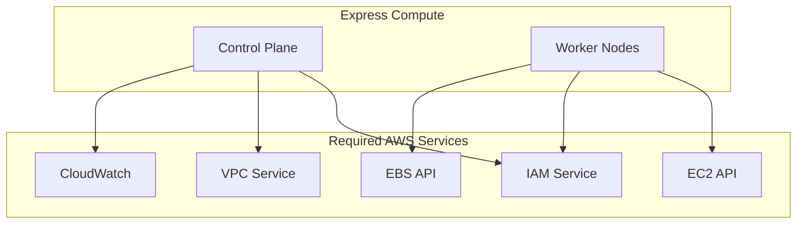
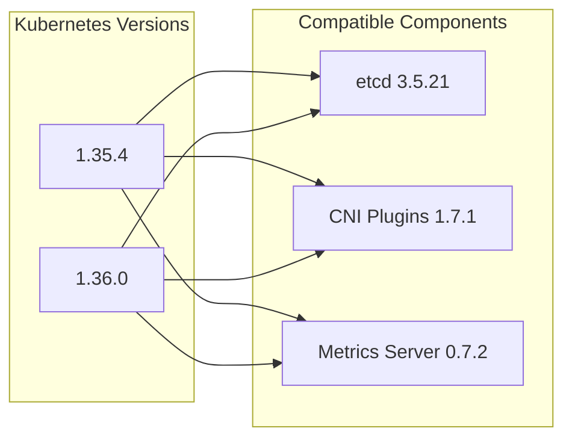

# Dependencies and External Integrations

## AWS Service Dependencies

### Core AWS Services
- **EC2**: Instance provisioning, AMI management, EBS volumes
- **IAM**: Authentication, authorization, service roles
- **VPC**: Networking isolation and security groups
- **Systems Manager**: Parameter store for configuration
- **CloudWatch**: Metrics, logs, and monitoring
- **Route53**: DNS resolution (optional)

### Dependency Graph


## External Software Dependencies

### Base System Requirements
- **Ubuntu 22.04 LTS**: Base operating system
- **containerd**: Container runtime (v1.6+)
- **Docker**: Build-time dependency for AMI creation
- **Helm**: Kubernetes package management (v3.x)

### Kubernetes Distribution
- **EKS-D**: AWS Kubernetes distribution
  - Kubernetes v1.35.4 or v1.36.0
  - etcd v3.5.21
  - CoreDNS v1.14.2
  - AWS IAM Authenticator v0.7.13+

## Build-Time Dependencies

### Infrastructure Tools
- **AWS CDK**: Infrastructure as Code (Java-based)
- **Packer**: AMI building and automation
- **Java 17+**: For CDK stack deployment
- **Maven**: Java build system for CDK

### Deployment Dependencies
- **AWS CLI**: AWS service interaction (v2.x)
- **kubectl**: Kubernetes cluster management
- **jq**: JSON processing in shell scripts

## Runtime Dependencies

### Kubernetes Add-ons
```yaml
required_addons:
  - name: "aws-vpc-cni"
    version: "v1.19.0"
    purpose: "Pod networking"
  
  - name: "aws-ebs-csi-driver" 
    version: "v1.38.0"
    purpose: "Persistent storage"
  
  - name: "karpenter"
    version: "latest"
    purpose: "Node autoscaling"
  
  - name: "cert-manager"
    version: "v1.x"
    purpose: "Certificate management"
```

### Monitoring Stack
- **Metrics Server**: Resource metrics collection
- **CloudWatch Agent**: AWS integration
- **Kubelet**: Built-in metrics endpoint

## Version Compatibility Matrix



## Network Dependencies
- **Internet Access**: For downloading components and container images
- **AWS API Endpoints**: Regional service endpoints
- **Container Registries**: 
  - public.ecr.aws (EKS-D images)
  - registry.k8s.io (Kubernetes images)
  - Docker Hub (third-party images)
