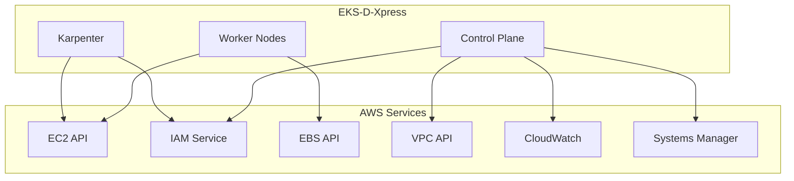
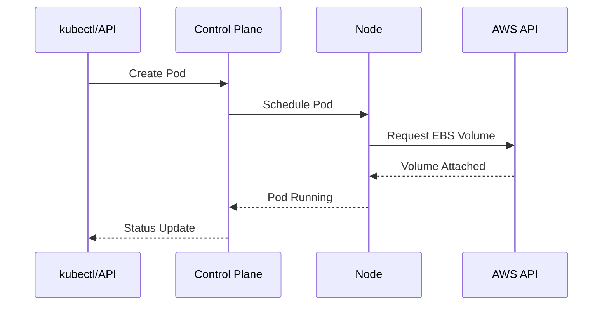
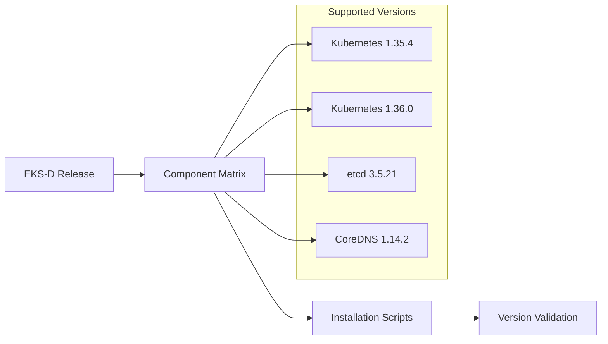
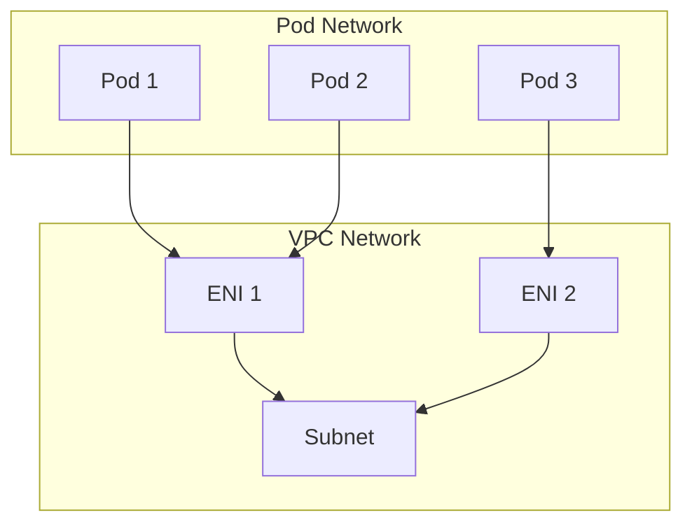

# Interfaces and Integration Points

## External APIs and Integrations

### AWS Service Integrations



**Integration Details**:
- **EC2**: Instance provisioning, AMI management, Security Groups
- **IAM**: Pod Identity, IRSA, service authentication
- **EBS**: Persistent volume provisioning via CSI driver
- **VPC**: Network isolation and CNI integration
- **CloudWatch**: Metrics, logs, and monitoring data
- **Systems Manager**: Parameter store for configuration

### Kubernetes API Interfaces



## Component Interfaces

### AMI Builder Interface
- **Input**: Packer configuration, installation scripts
- **Output**: Signed golden AMI with pre-installed components
- **API**: Packer JSON/HCL configuration format

### EKS-D Setup Interface
- **Input**: Infrastructure parameters, component versions
- **Output**: Configured Kubernetes cluster
- **API**: Shell script execution with environment variables

### CDK Stack Interface
```java
// EksDXpressPackerIamStack.java interface
public class EksDXpressPackerIamStack extends Stack {
    public EksDXpressPackerIamStack(Construct scope, String id, StackProps props)
    // Creates IAM roles and policies for Packer and EKS-D
}
```

## Configuration Interfaces

### Component Versions Interface
The system uses pinned versions defined in `COMPONENT_VERSIONS.md`:



### Progress Reporting Interface
```bash
# progress.sh functions
report_ready()     # Signal component ready
update_progress()  # Update installation progress
fail()            # Handle component failure
```

### Authentication Interface
- **AWS IAM Authenticator**: Integrates AWS IAM with Kubernetes RBAC
- **Pod Identity**: Direct IAM role association for pods
- **IRSA**: IAM Roles for Service Accounts (legacy compatibility)

## Network Interfaces

### VPC CNI Integration


### Load Balancer Integration
- **AWS Load Balancer Controller**: Manages ALB/NLB for Kubernetes Services
- **Service Type LoadBalancer**: Direct AWS ELB integration
- **Ingress**: ALB-based ingress routing

## Storage Interfaces

### EBS CSI Driver
- **StorageClasses**: Define EBS volume types and policies
- **PersistentVolumes**: Dynamic provisioning of EBS volumes
- **Volume Snapshots**: Backup and restore capabilities
