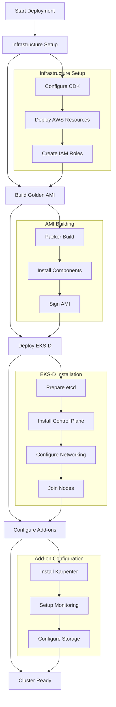
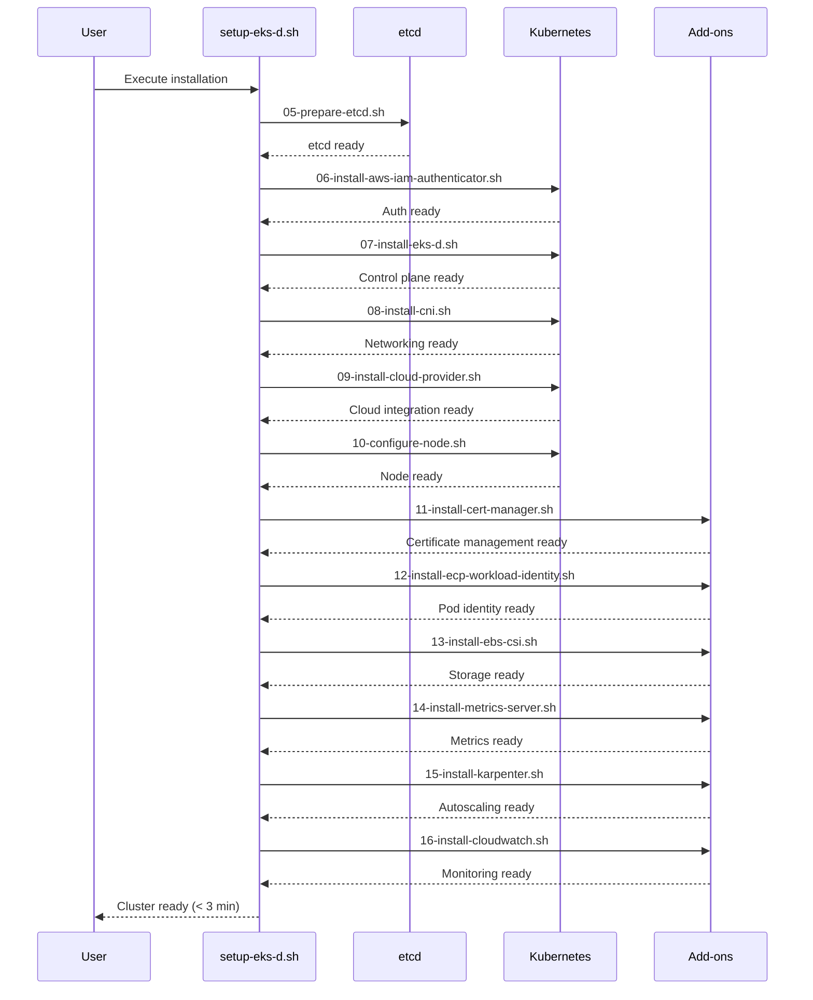
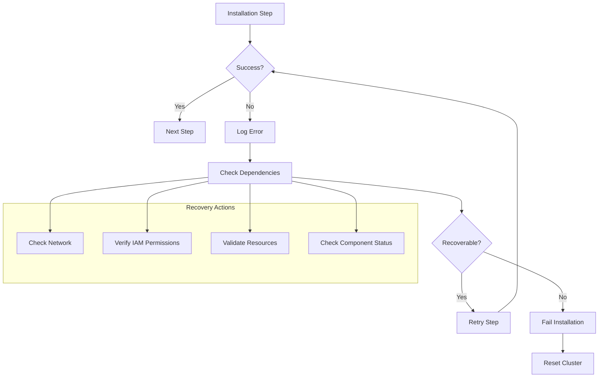
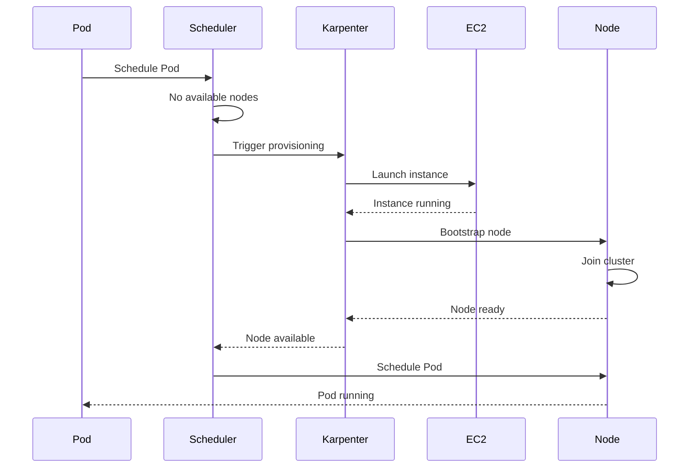
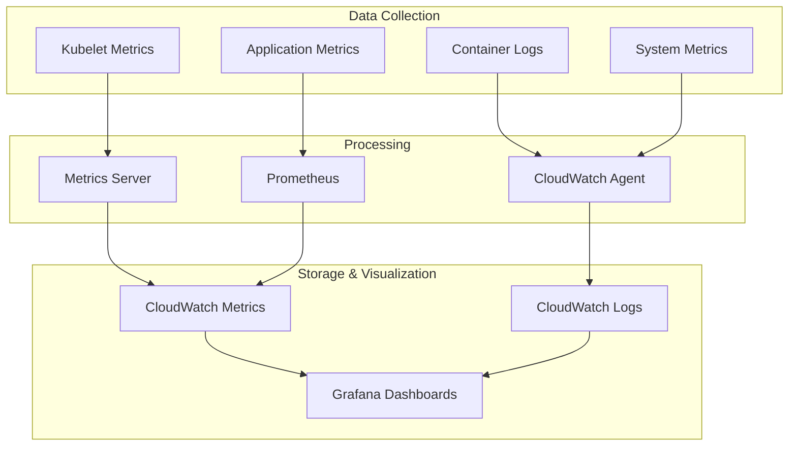
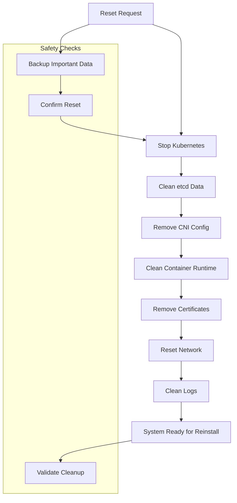

# Workflows and Processes

## Primary Deployment Workflow

## Sequential Installation Process

The EKS-D installation follows a strict sequence to ensure dependencies are met:

## AMI Building Workflow

```mermaid
flowchart LR
    A[Base Ubuntu 22.04] --> B[Configure containerd]
    B --> C[Install Base Packages]
    C --> D[Install Docker]
    D --> E[Install Helm]
    E --> F[Discover EKS-D Components]
    F --> G[Extract Container Images]
    G --> H[Pre-pull Images]
    H --> I[Sign AMI]
    I --> J[Golden AMI Ready]
    
    subgraph "Validation"
        K[Verify AMI]
        L[Test Boot]
        M[Validate Components]
    end
    
    J --> K
    K --> L
    L --> M
```

## Error Handling and Recovery

## Node Provisioning Workflow

## Monitoring and Observability Workflow

## Cleanup and Reset Workflow

