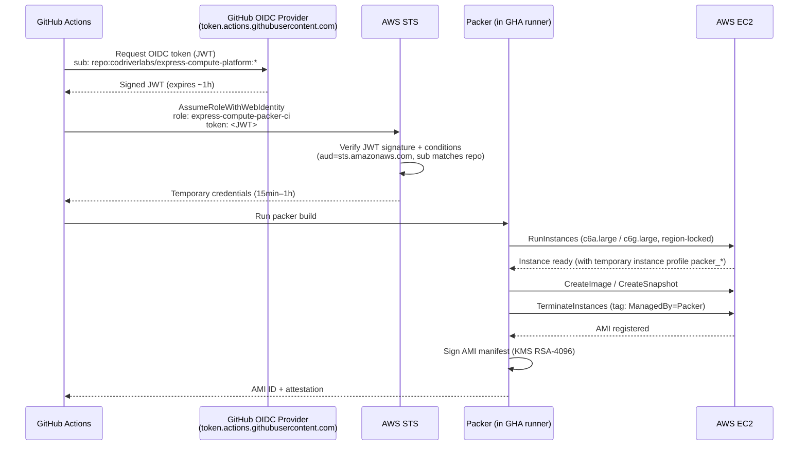

# Ecp Packer IAM — GitHub OIDC CI Stack

## Why this exists

Packer needs AWS permissions to build AMIs (launch an EC2 instance, snapshot it, register the image). The old approach used long-lived IAM access keys stored as GitHub secrets — a credential that never expires and can be leaked.

This CDK stack replaces that with **GitHub OIDC federation**: GitHub Actions exchanges a short-lived OIDC token for a temporary AWS session. No static credentials exist anywhere.

## Flow



## What the stack provisions

| Resource | Name | Purpose |
|---|---|---|
| IAM OIDC Provider | `token.actions.githubusercontent.com` | Trusts GitHub-issued JWT tokens |
| IAM Role | `express-compute-packer-ci` | Assumed by GitHub Actions via OIDC |
| Managed Policy | `express-compute-packer-boundary` | Permissions boundary — caps any role Packer creates |
| KMS Key | `alias/express-compute-ami-signing` | RSA-4096 key for AMI attestation signatures |
| SSM Parameter | `/express-compute/infra/kms/ami-signing-key-arn` | Key ARN for pipeline reference without hardcoding |

## Least-privilege design

**1. Destructive EC2 actions are tag-scoped**
`TerminateInstances`, `DeleteSnapshot`, `DeleteVolume`, etc. require `aws:ResourceTag/ManagedBy = Packer`. Packer sets this tag via `run_tags` in the HCL on creation, so cleanup is only allowed on resources Packer owns.

**2. Write actions are region-locked**
`CreateImage`, `CreateKeyPair`, `CreateSnapshot` etc. carry an `aws:RequestedRegion` condition matching the deployment region. A compromised token cannot operate in other regions.

**3. `RunInstances` is instance-type constrained**
`ec2:RunInstances` is scoped to `c6a.large` (x86_64) and `c6g.large` (arm64) — the exact types declared in `express-compute.pkr.hcl`. Packer cannot launch arbitrary instance sizes.

**4. IAM role creation is boundary-gated**
`iam:CreateRole` and `iam:PutRolePolicy` require `iam:PermissionsBoundary = express-compute-packer-boundary`. Without this, Packer could create a role with `AdministratorAccess` and assume it — a privilege escalation path.

**5. Temporary instance profile (`packer_*`)**
Packer uses `temporary_iam_instance_profile_policy_document` in the HCL to create a short-lived instance profile (named `packer_*`) attached to the builder EC2. The CI role has `iam:CreateInstanceProfile` and `iam:PassRole` scoped to `packer_*` only. The profile grants the builder instance exactly:
- ECR pull-through cache access (`GetAuthorizationToken`, `BatchCheckLayerAvailability`, `BatchGetImage`, `GetDownloadUrlForLayer`, `CreateRepository`, `BatchImportUpstreamImage`)
- SSM read for `/express-compute/*` parameters
- `sts:GetCallerIdentity` (needed by `install.sh` to resolve account/region)

**6. ECR pull on the CI role**
The CI role itself also has ECR pull permissions (`ecr:GetAuthorizationToken` + `BatchCheckLayerAvailability`, `GetDownloadUrlForLayer`, `BatchGetImage`) scoped to the deployment account's repositories, separate from the builder instance profile.

## Deploying

```bash
cd ami-builder/cdk
export CDK_DEFAULT_ACCOUNT=$(aws sts get-caller-identity --query Account --output text)
export CDK_DEFAULT_REGION=us-east-1
mvn -q compile
cdk deploy ExpressComputePackerIamGithubStack \
  -c githubOrg=codriverlabs \
  -c githubOrgId=236268168 \
  -c githubRepo=express-compute-platform \
  -c githubRepoId=1250509430
```

## GitHub Actions integration

Add to your workflow:

```yaml
permissions:
  id-token: write
  contents: read

steps:
  - uses: aws-actions/configure-aws-credentials@v4
    with:
      role-to-assume: arn:aws:iam::<account>:role/express-compute-packer-ci
      aws-region: us-east-1
```

No static credentials or GitHub secrets needed — the OIDC token is issued automatically by GitHub Actions.
